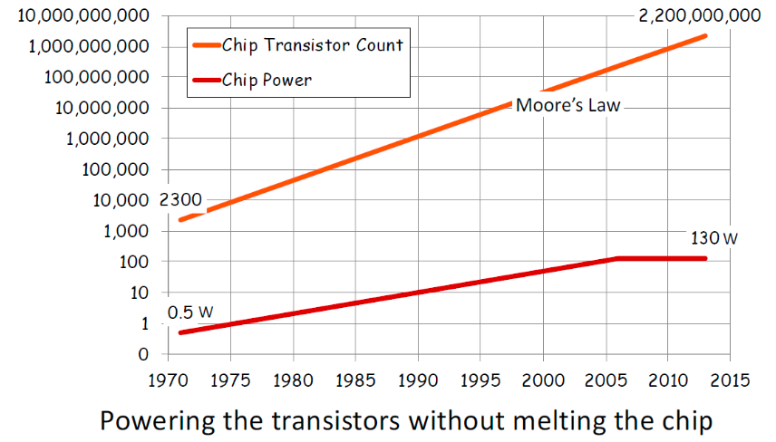
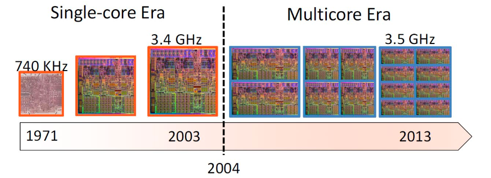

# 第一讲
  
1. 介绍并行算法设计与实现的基本方法  
2. 设计并实现并行算法以解决几个简单问题 
3. 并行计算  
定义:为何需要并行计算.并行计算机体系结构。
4. 互连网络
Frontier - 世界首台E级超算  
5. 并行计算机分类  
6. 并行编程模型  
7. 实验练习：熟悉EduCoder   
简单定义：使用并行计算机，例如多核计算机、计算机集群，或其他先进的并行/分布式计算系统，高速解决高级计算问题 
并行计算机的性能通常以每秒浮点运算次数 (FLOPS)来衡量FLOPS  
单个CPU的理论峰值FLOPS可以计算得出：  

8. 并行计算通过将一个大任务分解为多个较小的任务，然后将每个小任务分配给一个处理器来工作  
注意：在计算过程中，这些小任务可能需要协调，这使得并行计算更加复杂  

需要考虑的问题：
1. 如何将一个任务分解为多个较小的任务？  
这通常被称为任务分解 (Task Decomposition) 或 问题分解 (Problem Decomposition)，是并行算法设计的第一步。主要有以下几种策略：  
（1）数据分解 (Data Decomposition / Domain Decomposition)：如果任务主要是对大量数据进行操作，可以将数据分成小块，每个处理器负责处理一部分数据。例如，图像处理中可以将图像分割成小区域并行处理；科学计算中可以将大型矩阵或物理域分割。  
（2）功能分解 (Functional Decomposition / Task Parallelism)：如果任务包含多个可以同时执行的不同功能或步骤，可以将这些不同的功能分配给不同的处理器。例如，在一个复杂的系统中，一个处理器可能负责数据输入，另一个负责数据处理，第三个负责数据输出。
（3）流水线分解 (Pipeline Decomposition)：将任务分解为一系列有序的阶段，数据从一个阶段流向下一个阶段，每个阶段由不同的处理器并行处理。这类似于工厂的流水线作业。  
选择哪种分解方式取决于问题的特性、数据依赖关系以及可用的并行硬件架构。

2. 我们如何将任务分配给进程/线程？  
这涉及到任务分配 (Task Assignment) 或 负载均衡 (Load Balancing)。  
目标是将分解后的子任务有效地分配给可用的进程或线程，以最大限度地提高并行度并减少处理器空闲时间。

静态分配 (Static Assignment)：在程序运行前就确定好哪些任务分配给哪些进程/线程。这适用于任务大小和数量已知且固定的情况。 

动态分配 (Dynamic Assignment)：在程序运行时根据进程/线程的负载情况动态分配任务。当任务大小不一或难以预测时，
动态分配能更好地实现负载均衡，但会引入额外的分配开销。  
常用的动态分配策略有任务队列 (Task Queue) 或 主从模式 (Master-Worker)，即一个主进程/线程负责分发任务给空闲的工作进程/线程。

3. 如果进程/线程需要共享部分结果怎么办？ 
这是并行计算中的核心挑战之一，涉及到数据共享 (Data Sharing) 和 同步 (Synchronization)。  
共享内存模型 (Shared Memory Model)：如果是在多核处理器或共享内存系统中 (如使用OpenMP编程)，所有线程可以访问同一块内存区域。它们可以直接读写共享变量来共享结果。但需要注意的是，必须使用同步机制（如锁、互斥量、原子操作、屏障等）来避免竞争条件 (Race Conditions)，确保数据的一致性和正确性。  
分布式内存模型 (Distributed Memory Model)：如果是在计算机集群或分布式内存系统中 (如使用MPI编程)，每个进程拥有自己独立的内存空间。进程间共享结果必须通过显式的消息传递 (Message Passing) 来完成。一个进程将计算好的部分结果打包成消息，通过网络发送给另一个需要该结果的进程。  
协调 (Coordination)：无论是共享内存还是分布式内存，当任务之间存在依赖关系，或者需要汇总部分结果时，都需要协调。这可能涉及到等待其他任务完成特定操作，或者进行全局的归约操作 (Reduction) 等。  
4. 并行程序的性能如何？ 
并行程序的性能评估是衡量其有效性的关键。主要有以下几个指标和概念：

加速比 (Speedup)：定义为同一个问题在单处理器上运行的时间 与在 p 个处理器上并行运行的时间之比。理想情况下，加速比等于处理器数量 p，但实际中由于并行开销（如通讯、同步、负载不均等）的存在，通常会小于 p。
效率 (Efficiency)：定义为加速比与处理器数量 p 之比。它衡量了并行计算资源的利用程度，理想情况下为1 (或100%)。
阿姆达尔定律 (Amdahl's Law)：指出了并行程序加速比的理论上限。它认为程序中总有一部分是无法并行化的串行部分，这个串行部分限制了通过增加处理器数量所能获得的最终加速效果。
可扩展性 (Scalability)：衡量当问题规模和处理器数量同时增加时，并行程序保持其效率的能力。
并行开销 (Parallel Overhead)：指并行计算引入的额外时间消耗，包括：
进程/线程创建和管理开销。
通讯开销：在分布式内存系统中，进程间传递数据所需的时间。
同步开销：为保证数据一致性或任务协调而等待的时间。
负载不均衡：某些处理器提前完成任务而空闲等待，另一些处理器则任务过重。
冗余计算：有时为了减少通讯，可能会在多个处理器上进行一些重复计算。
5. 为何需要并行计算？
技术推动 
如今，即使是我们的笔记本电脑或手机也是并行计算机——每台计算机都是并行计算机 
应用驱动 
许多现代应用，如大数据分析、人工智能和深度学习，都严重依赖并行计算  
“频率墙”：提高频率和更深的流水线在性能上的回报已逐渐减少 
“功耗墙”：如果运行速度再快（时钟频率更高），芯片将会熔化 
“指令级并行墙 (ILP wall)”：在寻找更多指令级并行方面，回报也在逐渐减少，摩尔定律依然有效，然而，无法显著提高频率来提升性能 

多核技术
对于单核，频率增加50%，性能提升1.5倍，但功耗增加3.3倍 
使用双核，要达到同样的峰值性能，我们实际上可能将频率降低25%，从而将功耗降低到0.8倍 

计算应用
随着计算成本的改善，计算机的应用机会成倍增加。    
风暴预报和气候预测 
理解生物体的生物化学过程，计算流体动力学和飞机设计，地震和结构建模，分子纳米技术，计算金融。

大数据（数据分析）
如今，在天文学、粒子物理学、智慧城市和电子健康等许多领域，数据泛滥已是常见现象 
数据量的急剧增加也需要大量的计算能力，才能将原始数据转化为有意义的信息，这要求使用并行和分布式计算策略  这些苛刻的要求推动了诸如MapReduce等高级编程模型的开发，以简化多台机器上数据密集型计算的并行化 

深度学习
深度学习 (DL)，或深度神经网络 (DNN)，是一类受人脑结构和功能启发的机器学习算法 
DNN通过分析大量数据进行训练，以实现分类和预测 
它目前已成功应用于实践中的各种应用，并在我们的日常生活中扮演着越来越重要的角色 
然而，其巨大成功主要归功于可用训练数据量的增加以及更强大的计算资源，这使我们能够训练更大更深的神经网络 
并行计算机体系结构
三种物理组织类型：
多核 
多个核心共享内存 
小规模（高端约100个核心） 
集群 
多个处理单元 (PE)，即独立的计算机，可以包含多核和/或GPU，通过互连网络连接 
大规模，几乎所有的超级计算机都是集群 
GPU 
附加加速器——最初为图形处理而设计 
如今可用作一种更通用的GPU，用于具有规则计算和数据模式的应用，尤其适用于机器学习 
如今所有的计算机都是多核计算机系统：
一定数量的处理器或核心 
片上缓存 
共享全局内存空间（外部缓存和DRAM） 
（图片展示两个处理器，各自带有片上缓存，连接到共享缓存，最底层是全局内存）
计算机集群

多个独立的计算机通过互连网络连接 
每个独立的计算机都是一个拥有其自身本地内存的多核系统 
大多数超级计算机都是一种计算机集群 
每个计算节点不仅包含多个核心，还包含GPU 
例如，目前世界上最快的超级计算机“Frontier”包含9472个计算节点，每个节点由一个64核CPU和四个GPU组成 
每个GPU包含：
多个SM - 流式多处理器 (Streaming Multiprocessor) 
多个SP - 流处理器 (Streaming Processor) (“标量处理器核心”) (也称为“线程处理器”) 
寄存器文件 
共享内存 
常量缓存 (对SM只读) 
纹理缓存 (对SM只读) 
设备内存 
（GPU内部结构示意图，展示多个SM单元，以及ROP单元、L2缓存和GDDR5内存接口）
现代GPU
新一代GPU，例如 GeForce RTX 4090：
每个流式多处理器 (SM) 
128个核心 (流处理器，或SP) 
16MB共享内存 
32MB寄存器文件 
4个用于机器学习的张量核心 (tensor cores)  该芯片拥有128个SM，即16384个核心，512个张量核心，以及72MB二级缓存 
互连网络

互连网络是计算机系统中最关键的组件之一，它对应用程序的性能有显著影响，尤其是在大规模计算系统中 
两种网络类型：静态和动态 
在静态网络中，消息必须沿着已建立的链路路由 
这意味着单个消息在到达目的地的过程中必须经过中间处理器进行跳转  
动态网络在消息沿着链路和交换机路由时，动态地在两个或多个节点之间建立连接  
全互连网络是一种静态网络，每个处理器都连接到其他所有处理器，网络中的链路数量按P*P规模增长，其中p是处理器数量 
虽然性能扩展性非常好，但对于较大的p值，硬件复杂度是无法实现的  
交叉开关 (Crossbar) 是一种交换式网络 
p个处理器的交叉开关成本按 O(p2) 增长 
通常难以针对较大的p值进行扩展 

Frontier是世界上第一台百亿亿次 (exaFLOPS,1e18 FLOPS) 超级计算机，位于美国橡树岭领导计算设施，它使用了9472个计算节点，每个节点包含一个64核CPU和4个GPU（因此总共有606208个CPU核心和37888个GPU） 
计算节点使用最先进的Slingshot网络互连，Slingshot互连网络的核心是Rosetta交换机，默认拓扑是Dragonfly——一种分层的直接拓扑结构  
4行8列的tile 
每个tile有两个交换端口 
基于行总线、列通道和每tile交叉开关的分布式交叉开关  
Rosetta交换机有64个200 Gb/s的端口，用于连接计算节点或其他交换机以形成不同的互连网络  
端口被分组成32个tile，每个tile有2个端口 
Tile被组织成4行8列 
同一行上的tile通过16条行总线连接 
行总线用于将数据从相应端口发送到该行上的其他端口 
同一列上的tile通过每tile交叉开关连接 
每tile交叉开关有来自该行16个端口的16个输入和到该列8个端口的8个输出 
从一个端口到另一个端口最多需要2跳（直径=2） 
Dragonfly是一种分层的直接拓扑结构  
交换机被组织成组  
通常是机柜 组内交换机使用电链路（铜缆）以全互连（或完成图）方式连接  组间也以全互连方式连接，但使用光链路（光缆）  
灵活的计算和I/O，高密度计算，互连网络  
优点：  
低延迟：由于组内和组间的全连接性，Dragonfly的交换机到交换机直径为3跳   
低成本：与大型系统的其他拓扑相比，最大限度地减少了长光缆的使用   
高度模块化和可扩展性强  

弗林分类法 (Flynn's Taxonomy)：斯坦福大学的 Michael Flynn 教授于60年代提出的计算机分类方法 
大多数现代计算机是这些类型的组合 
指令流/数据流 | 单数据流 (Single) | 多数据流 (Multiple)
------- | -------- | --------
单指令流 (Single) | SISD (单指令流单数据流) &lt;br> 单处理器 | SIMD (单指令流多数据流) &lt;br> 处理器阵列 &lt;br> 流水线向量处理器
多指令流 (Multiple) | MISD (多指令流单数据流) &lt;br> 很少使用 | MIMD (多指令流多数据流) &lt;br> 多处理器 &lt;br> 多计算机

计算机分类
物理组织
目前，并行计算机基本上可以分为三类：
共享内存机器 (MIMD) 
例如，具有共享内存的多核处理器：小规模，高端单节点计算服务器仅包含几十个核心，分布式内存机器 (MIMD)  
多个计算节点，每个节点都有自己的本地内存  
高度可扩展  
所有超级计算机都是分布式内存机器  

加速器 
SIMD（单指令多数据）用于数据并行计算 
例如，GPU、TPU  大规模现代并行计算机是上述类型的组合，例如，计算机集群由若干具有分布式内存的计算节点组成，每个节点包含具有共享内存的多个核心，并且可能还包含一个甚至多个加速器  
并行编程模型逻辑组织（或并行计算平台）- 提供了一种思考并行程序组织方式的方法基于分类，我们有三种并行计算平台：
共享内存 
分布式内存 
SIMD（数据并行）和多线程  

使用 OpenMP 的共享内存平台 
使用 MPI 的分布式内存平台 
我们还将简要讨论用于 GPU 的 CUDA 编程，但没有练习 
实验练习1：EduCoder (头歌平台)
熟悉 EduCoder 
编译并运行两个 "Hello World!" 程序 
omp_hw.c 
编译：gcc -fopenmp -o omp_hw omp_hw.c 
运行：./omp_hw 
mpi_hw.c 
编译：mpicc -o mpi_hw mpi_hw.c 
运行：mpirun -np x mpi_hw 
x 是一个整数，表示将创建多少个进程 
你可以用不同的 x 多次运行程序 
