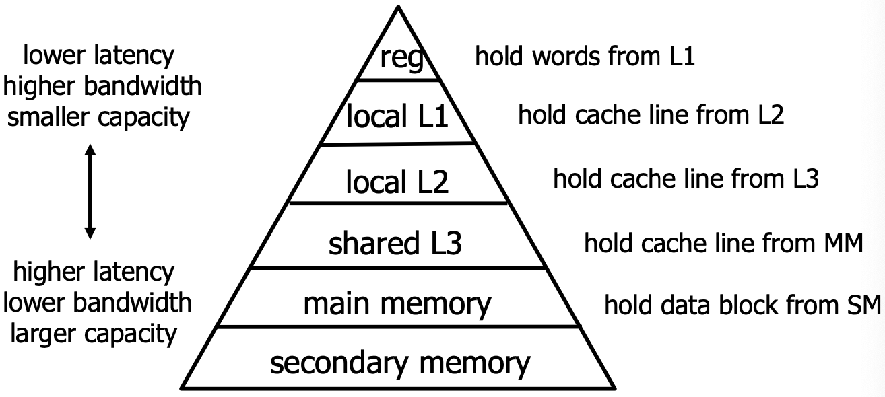
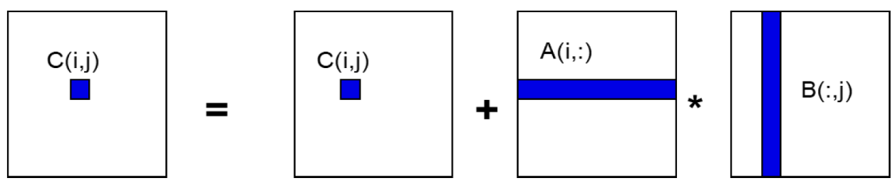
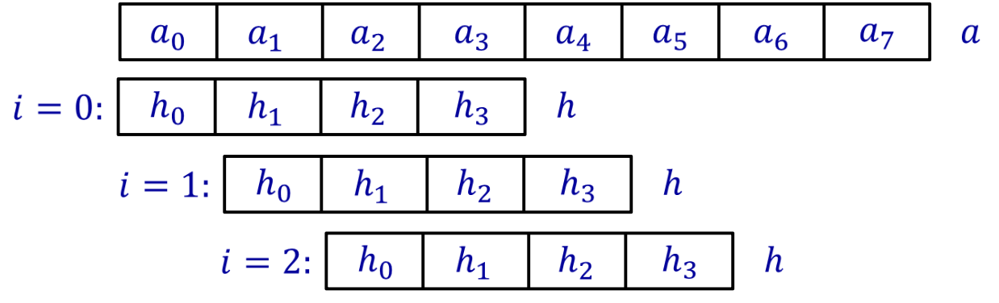

# 第二讲

内存层次结构
计算强度
矩阵乘法
连续内存访问

实验练习1：矩阵乘法
分块
循环展开
实验练习2：使用循环展开的矩阵向量乘法
家庭作业1：使用循环展开的矩阵乘法

大多数未经优化的并行程序运行速度不到机器“峰值”性能的10%。 
很多性能损失发生在单处理器上。大部分损失发生在内存系统中。缓存、寄存器和指令级并行(ILP)由硬件和编译器管理。 有时它们能做到最好。但其他时候却不行。我们需要编写程序，使硬件和编译器能更清晰地理解，从而更好地优化我们的代码以实现高性能。
1. 内存层次结构  
在计算机内存系统中，我们有寄存器、缓存、主存和辅存。它们共同构成了内存层次结构。（内存层次结构图：从上到下依次为寄存器、本地L1缓存、本地L2缓存、共享L3缓存、主存、辅存。箭头指示：越往上，延迟越低、带宽越高、容量越小；越往下，延迟越高、带宽越低、容量越大。文字说明各层级缓存/内存的作用，例如：寄存器保存来自L1的字，L1保存来自L2的缓存行等。）  
大多数程序表现出高度的局部性：  
（1）空间局部性：访问先前访问过的条目附近的数据。  
（2）时间局部性：重用先前访问过的条目。 
  

利用内存层次结构来提高性能：
（1）将值保存在小而快的内存（缓存或寄存器）中并重用它们。(时间局部性) 
（2）将一块连续的数据读入缓存（或向量寄存器）并使用整块数据。(空间局部性) 
2. 计算强度
假设内存层次结构只有两层：快速内存和慢速内存。所有数据最初都在慢速内存中。同时假设：
m= 在快速和慢速内存之间移动的内存元素（字）的数量。 
t(m)= 每次慢速内存操作的时间。 
f= 算术运算的次数。 
t(f)= 每次算术运算的时间 ≪t(m)
当所有数据都在快速内存中时，可能的最小时间 =f×t(f)
实际时间 =f×t(f)+m×t(m)=f×t(f)×(1+t(f)/t(m)/q)   
其中 q=f/m 是每次慢速内存访问的平均浮点运算次数——计算强度（算法效率的关键）。 
更大的 q 意味着时间更接近最小时间 f×t(f) 
t(m)/t(f) - 机器平衡（机器效率的关键）。 
需要 q≥t(m)​/t(f)才能达到至少一半的峰值速度。 

提高单机性能：
（1）增加计算强度。（2）降低缓存未命中率。
（3）连续内存访问。（4）分块。（5）高效利用寄存器。（6）循环展开。 
3. 矩阵乘法
ijk版本：
```c
for (i=0; i<n; i++)
  for (j=0; j<n; j++) // 注意：幻灯片此处原文为 i=0; i<n; i++，根据上下文应为j
    for (k=0; k<n; k++)
      C(i,j) = C(i,j) + A(i,k) * B(k,j);
```

```c
for (i=0; i<n; i++)
  {将A的第i行读入快速内存} 
  for (j=0; j<n; j++) 
    {将C(i,j)读入快速内存} 
    {将B的第j列读入快速内存} 
    for (k=0; k<n; k++)
      C(i,j) = C(i,j) + A(i,k) * B(k,j);
    {将C(i,j)写回慢速内存}  
```
慢速内存引用次数： 
    m= n*n*n (读取B的每一列n次)  
     —— +n*n(读取A的每一行一次) 
     —— +2*n*n(读和写C的每个元素两次)
  q= f/m = 2*n*n*n /（n*n*n+3*n*n）≈2（对于大的n）
在矩阵乘法中，总数据量为 3n*n。   
理想的 q 值应尽可能大，达到 2n*n*n/（3*n*n*n）≈O(n)，

注意在矩阵乘法中：  
所有的乘法都可以独立完成。加法满足结合律和交换律。那么循环顺序可以改变而不影响最终的乘法结果。在上面的讨论中，循环顺序设置为 ijk。不同的循环顺序怎么样？  
考虑 ikj 版本。 
连续内存访问
数据在缓存和主存之间以缓存行（由多个字组成）为单位传输。 
连续内存访问对于降低缓存未命中率，从而提高计算强度非常重要。 
ikj 版本：
```c
for (i=0; i<n; i++)
  for (k=0; k<n; k++)
    for (j=0; j<n; j++) // 注意：幻灯片此处原文为 i=0; i<n; i++，根据上下文应为j
      C(i,j) = C(i,j) + A(i,k) * B(k,j);
```
```c
for (i=0; i<n; i++)
  for (k=0; k<n; k++)
    {将A(i,k)读入快速内存}
    for (j=0; j<n; j++) 
      {将C的第i行读入快速内存}
      {将B的第k行读入快速内存}
      C(i,j) = C(i,j) + A(i,k) * B(k,j);
    {将C的第i行写回慢速内存}
```
注意：
数据以缓存行为单位加载到缓存。 
在C语言中，二维矩阵按行主序存储在内存中。 
C和B是按行引用的。 
假设缓存行能容纳L个字。 
那么访问每一行只需要 n/L 次慢速内存访问。 
```c
for (i=0; i<n; i++)
  for (k=0; k<n; k++)
    {将A(i,k)读入快速内存} // 读取A的每个元素一次
    for (j=0; j<n; j++) // 注意：幻灯片此处原文为 i=0; i<n; i++，根据上下文应为j
      {将C的第i行读入快速内存}
      {将B的第k行读入快速内存} // 读取B的每一行n次
      C(i,j) = C(i,j) + A(i,k) * B(k,j);
    {将C的第i行写回慢速内存} // 读和写C的每一行两次
```
慢速内存引用次数：
m=n2/L (读取A的每个元素一次) +n3/L (读取B的每一行n次) +2*n2/L (读和写C的每一行两次)
q=mf=2*n3/（n3/L+3*n2/L）≈2L 
这是一个巨大的进步！ 
4. 分块
将数据分成块，使每个块都能装入缓存。 
在数据被从缓存中替换出去之前，尽量多次使用块内的数据。  分块矩阵乘法
假设A, B, C (大小为n×n) 是由b×b子块组成的N×N矩阵，其中 b=n/N 是块大小。 
```c
for (i=1 to N)
  for (j=1 to N)
    {将块C(i,j)读入快速内存}
    for (k=1 to N)
      {将块A(i,k)读入快速内存}
      {将块B(k,j)读入快速内存}
      // 对b×b的块进行矩阵乘法
      C(i,j) = C(i,j) + A(i,k) * B(k,j);
    {将块C(i,j)写回慢速内存}
```
慢速内存引用次数：
m=N⋅n2(B的每个块被读取 N3次，原文此处有误，应为 N 次，因为B的每个块在计算C的一个块时仅被完整读入一次，整个过程C有 N2个块，每个C块需要N个B块，所以B的总读取次数更接近 N3⋅b2/L 或 N2⋅n⋅b/L。幻灯片给出的 N⋅n2结果是最终简化后的总和的一部分)
(N3⋅b2=N3⋅(Nn​)2=N⋅n2)
幻灯片此处的推导是为了说明N⋅n2
这一项的来源，指B的每个块被读取N次，总共N^2个块，所以是NN^2b^2次元素读取，若以块为单位，则是N^3次块读取，每次b^2元素。更精确的分析应为，计算C(i,j)时，A(i,k)和B(k,j)各被读N次。C(i,j)读写各一次。）
+N⋅n2(A的每个块被读取 N3次，同上)
+2*n2(C的每个块被读写一次)
=(2N+2)n2
分块矩阵乘法的计算强度：
q= f/m​= 2*n3（(2N+2)n2）≈ n/N=b   
通过增加块大小 b≫2 可以提高性能（只要 3*b2< 快速内存大小）。 
5. 循环展开
循环展开是一种循环变换技术，有助于优化程序的执行时间。减少分支惩罚，即减少控制循环的指令，如指针运算和每次迭代的“循环结束”测试。高效利用多个寄存器，即通过将数据项预加载到寄存器中来减少对内存带宽的需求。增加计算强度，即将数据项加载到寄存器中然后多次使用。 
6. 卷积
```c
Initialize s[i]=0;
for (i = 0; i <= N-L; i++)
  for (j = 0; j < L; j++) 
    s[i] += h[j] * a[i+j]; 
```

当 i=0 时，h 与 a 的前L个元素相乘累加。
当 i=1 时，h 与 a 的从第二个元素开始的L个元素相乘累加。
当 i=2 时，h 与 a 的从第三个元素开始的L个元素相乘累加。）
```c
Initialize s[i]=0;
for (i=0; i<=N-L; i++)
  for (j=0; j<L; j++)
    s[i] += h[j] * a[i+j]; 
```
改变循环顺序
```c
Initialize s[i]=0;
for (j=0; j<L; j++) 
  for (i=0; i<=N-L; i++)
    s[i] += h[j] * a[i+j]; 
```
循环展开（展开因子=4）
```c
Initialize s[i]=0;
for (j=0; j<L; j+=4) { 
  float h0=h[j];   
  float h1=h[j+1]; 
  float h2=h[j+2]; 
  float h3=h[j+3]; 
  for (i=0; i<=N-L; i++)
    s[i] += (h0*a[i+j] 
            +h1*a[i+j+1]   
            +h2*a[i+j+2]  
            +h3*a[i+j+3]); 
}
```
6. 矩阵向量乘法  
计算 y=y+Ax
假设矩阵A的大小为 n×n，y和x是大小为n的向量。 
```c
for (i=0; i<n; i++)
  for (k=0; k<n; k++) 
    y[i] = y[i] + a[i][k] * x[k]; 
```
将i循环展开，展开因子=4：
```c
register double y0, y1, y2, y3, x0; 
for (i=0; i<n; i+=4) {
  y0=y[i]; y1=y[i+1]; y2=y[i+2]; y3=y[i+3]; 
  for (k=0; k<n; k++) {
    x0=x[k];
    y0 += a[i][k]   * x0;  
    y1 += a[i+1][k] * x0;  
    y2 += a[i+2][k] * x0;
    y3 += a[i+3][k] * x0; 
  }
  y[i]=y0; y[i+1]=y1; y[i+2]=y2; y[i+3]=y3;
}
```
