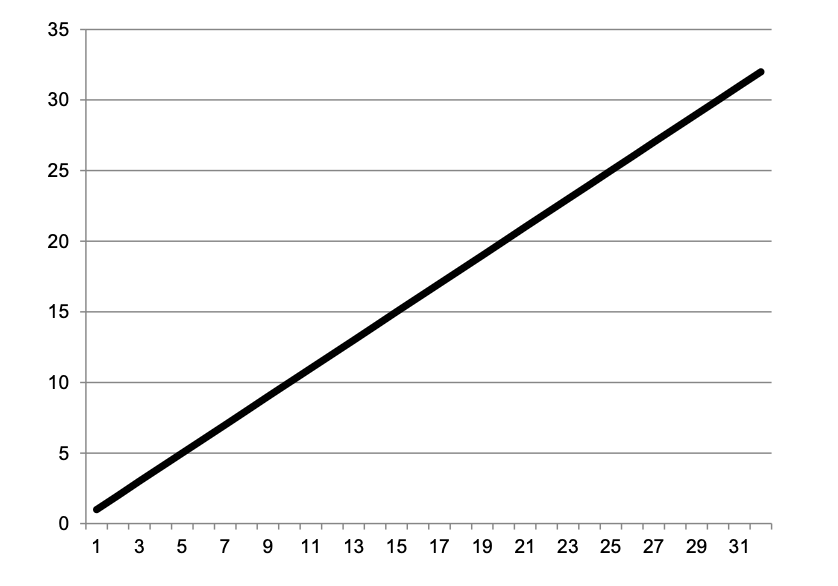
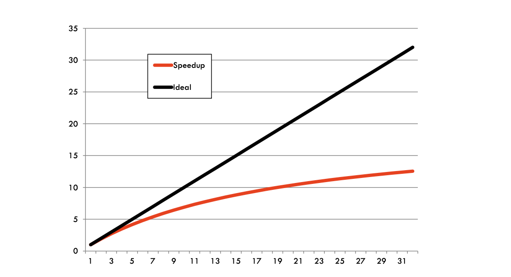
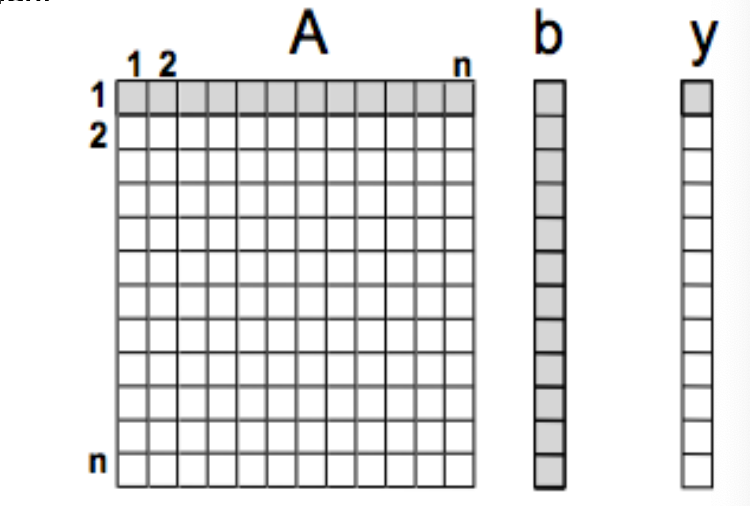
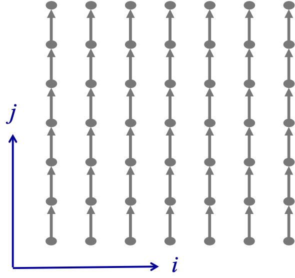
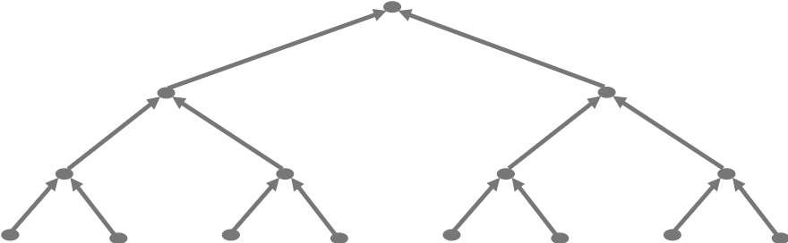
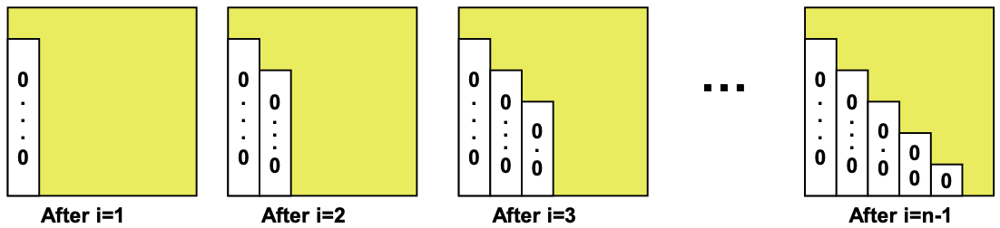
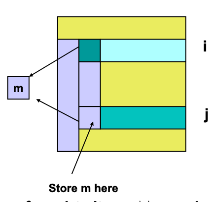

# 第三讲
1. main
（1）加速比和效率（2）阿姆达尔定律和开销（3）通用设计过程:a. 机器无关部分：划分，通信/同步；任务依赖图；数学结合律。b. 机器相关部分:分配和负载均衡。  
2. 加速比和效率
并行计算旨在实现高性能——高速度  

并行算法的加速比是衡量其相对于解决同一问题的串行算法的相对性能提升的指标  
定义：最快串行算法的计算时间与并行算法的时间之比。令 T(s) 为使用单个处理器时的计算时间，T(p) 为使用 p 个处理器时的计算时间,那么加速比定义为： S=
T（s）/T（p）  

并行算法的效率是处理器被计算有效利用的比例，定义为： E=
S/p=T(s)/p/T(p)   

加速比和效率:当使用 p 个处理器解决问题时，我们是否期望得到 p 倍的加速比，即高效率？ 
可能不会！  
原因： 大多数并行程序除了计算之外还会引入开销，这些开销包括：进程/线程通信或同步   
可用处理器/线程之间的工作负载不平衡  
为管理计算和增加并行性而引入的额外工作  
令 T（o）=p/T（p）−T（s） 为总开销。那么： E=T（s）/p/T（p）=T（s）/（T（o）+T（s））=1/（1+T（o）/T（s））。0<=E<=1，当 T(o) 很大时，E 会很小   
理想加速比
加速比：S=T(s)/T(p)  
理想情况下，我们期望在使用p 个处理器时，加速比能提高p 倍  


实际加速比：
在实践中，解决问题的实际加速比通常小于理想加速比，并且随着处理器数量的增加而变得更差


阿姆达尔定律 (Amdahl's Law)
阿姆达尔定律用于预测使用多个处理器进行并行计算时的理论加速比。它表明并行程序中的串行部分对潜在的加速比施加了严格限制 
假设解决问题的总运算量可以分为两部分：1. beta 是纯粹串行的。2. 1−beta 是完全可以并行化的。使用 p 个处理器的并行时间将是： T（p）=betaT（s）+(1−beta)T（s）/p  

阿姆达尔定律
加速比为：S=T（s）/T（p）=T（s）/（betaT（s）+(1−beta)T（s）/p）=p/（1+beta(p−1)）   
当 p 非常大时，我们有：S-> 1/beta。beta成为一个限制因素
例如，当程序中只有5%是串行部分时，即 beta=0.05，无论使用多少处理器，加速比都不能超过20！  

开销 (Overheads)
我们知道：
E=T（s）/p/T（p）=T（s）/（T（o）+T（s））=1/（1+T（o）/T（s）  
除了单处理器性能不佳之外，导致低效率的主要原因是开销，因此，在设计和实现并行算法时，我们必须尽最大努力最小化所有不必要的

开销   
设计并行算法
如何将问题描述转化为一个展现并发性、可扩展性和局部性的算法，并行算法设计不容易简化为简单的套路，相反，它需要通常被称为“创造力”的综合性思维，可能需要以前没有研究过的新思想 

通用设计过程  
通用的设计过程包括两个阶段：  
机器无关阶段 ：  
根据给定问题的特性识别并行执行的机会   
划分 (Partitioning)：将一个大任务分解为多个可以并发执行的较小任务  
通信/同步 (Communication/synchronization)：协调并发任务的执行并建立适当的通信/同步结构   
机器相关阶段 ：  
分配 (Assignment)：根据特定机器的特性重新组织任务并将它们分配给多个进程/线程。最小化开销并在处理器间平衡工作负载   

划分 (Partitioning)
揭示并行执行的机会  
重点是定义大量的小任务，每个任务包含计算及其操作的数据。  
典型的划分类型：  
任务划分 (Task partitioning)  
首先将计算划分为若干部分，然后将数据与计算关联起来  
数据划分 (Data partitioning)  
首先将数据划分为若干部分，然后将计算与数据关联起来 具体应用哪一种取决于实际问题 

通信/同步 (Communication/Synchronization)
通过划分产生的任务旨在并发执行，但通常不能独立执行，数据必须在任务之间传输，以使计算能够进行。  
因此需要通信/同步来管理数据传输和/或协调任务的执行，高效地组织通信可能具有挑战性   

矩阵向量乘法
任务划分： 划分向量 y，每个元素为一个任务，计算每个元素 c（应为y）涉及 A 的一行和向量 b（应为x）  
注：任务大小统一 ，任务之间没有依赖关系。易于并行（Embarrassingly parallel）
示例：矩阵向量乘法

数据划分：
我们可以划分矩阵A和向量b（应为x），然后将每次乘法（A的一个元素和b（应为x）的一个元素）关联为一个任务 [来源: 19]。 注意这些小任务的结果只是中间结果，它们将被视为新数据用于构建后续的新任务 。 这等同于将每个内积进一步划分为n个更小的任务。 注：任务大小统一。适合细粒度并行 。
但是计算两个向量内积的任务之间存在依赖关系！需要通信/同步

算法的并行结构
为解决给定问题设计并行算法，通常第一步是检测串行算法的并行结构，如果算法的并行结构确定了，许多后续的决策就会变得显而易见。
任务依赖图是识别程序并行结构的良好技术之一   
任务依赖图 (Task-Dependency Graph)
在任务依赖图中，每个节点代表一个任务，节点之间的箭头表示任务之间的依赖关系。
主要目的是展示并行结构，以论证算法的各种属性，例如：
并行结构模式 - 规则性  
边集特征 - 依赖性 
结构依赖于输入数据 - 工作预测    
通常展示一个小图就足够了。然而，为复杂算法构建图具有挑战性。  
每个节点代表 a（ij） 和 b（j） 的一次乘法。箭头表示顺序的加法（数据依赖）。每条垂直的箭头-节点线代表点积 y（i）的一个输出

数学结合律
算法的并行结构是一个重要概念，但不应单独使用
要评估算法的并行潜力，算法背后的数学原理起着同等重要的作用。  
了解算法的数学基础可以增加并行度——这在实践中非常重要。  
考虑n个整数求和：s=sum_i=0，n−1 a（i）    
对于典型的串行程序：
```c
s=0;
for (i=0; i<n; i++)
  s = s + a[i];
```
算法的结构：
它本质上是完全串行的！
加法运算满足结合律,对于求和，加法可以按任何顺序进行。然后我们可以得到一个新的算法：
sum_i=0 2n−1 a(i)=sum_i=0 n−1 a(i)+sum_i=n 2n−1 a(i) 递归地进行成对相加
并行结构形成一个二叉树  
并行度从n变为1（应指从1变为n或log n，串行依赖长度从n变为log n）

分治技术 (Divide and conquer technique)：
分解 (Divide)：将数据划分为n组，每组一个元素  
解决 (Conquer)：递归地成对相加   
该技术在实践中广泛用于归约操作 (reduction operations)。 操作符不必是加法，任何满足结合律的运算都可以。
实验练习：带循环展开的高斯消元法

修改程序 gepp_0.c，为通用情况添加循环展开，展开因子=4，即n可能不能被4整除
测试程序的正确性并检查性能。
如果无法完成，则作为家庭作业2带回家做。
高斯消元法

对于一个给定的 N x N 矩阵 A，将每一行的倍数加到后续行，使 A 成为上三角矩阵 [来源: 30]：
// 对每一列 i，通过将第 i 行的倍数加到后续行，将其对角线下方的元素清零
```F90
for i = 1 to n-1
  // 对第 i 行下方的每一行 j
  for j = i+1 to n
    // 将第 i 行的一个倍数加到第 j 行
    tmp = A(j,i);
      A(j,k) = A(j,k) - (tmp/A(i,i)) * A(i,k); 
```

将乘数 m 存储在对角线下方的零元素位置，以备后用
```f90
for i = 1 to n-1
  for j = i+1 to n
    A(j,i) = A(j,i) / A(i,i)  // 将乘数m存储在此处
    for k = i+1 to n
      A(j,k) = A(j,k) - A(j,i) * A(i,k)
```
称乘数的严格下三角矩阵为 M，令 L=I+M （此处幻灯片原文为 M_1，根据上下文通常用M表示乘数矩阵，L为下三角单位阵） [来源: 32]。
称最终矩阵的上三角部分为 U [来源: 32]。
引理 (LU分解)：如果上述算法终止（没有除以零），则 A=L
cdotU 

$A = \\begin{bmatrix} 0 & 1 \\ 1 & 0 \\end{bmatrix}$ 完全失败，因为不能除以 A(1,1)=0 
但求解 Ax=b 应该很容易！
当对角线元素 A(i,i) 非常小（不仅仅是零）时，算法可能终止但得到完全错误的答案 
数值不稳定性,舍入误差是原因,解决方法：选主元 (Pivoting) (交换 A 的行) 使 A(i,i) 较大。
带部分主元的高斯消元法
部分主元法：交换行，使得 A(i,i) 是该列中最大的元素
```f90
for i = 1 to n-1
  找到并记录 k 使得 |A(k,i)| = max_{i <= j <= n} |A(j,i)| // 即第i列剩余元素中绝对值最大的项
  if |A(k,i)| = 0
    发出警告退出，A是奇异的或接近奇异
  elseif k != i
    交换 A 的 i 行和 k 行
  end if
  A(i+1:n, i) = A(i+1:n, i) / A(i,i) // 每个商的绝对值 <= 1
  A(i+1:n, i+1:n) = A(i+1:n, i+1:n) - A(i+1:n, i) * A(i, i+1:n)
```