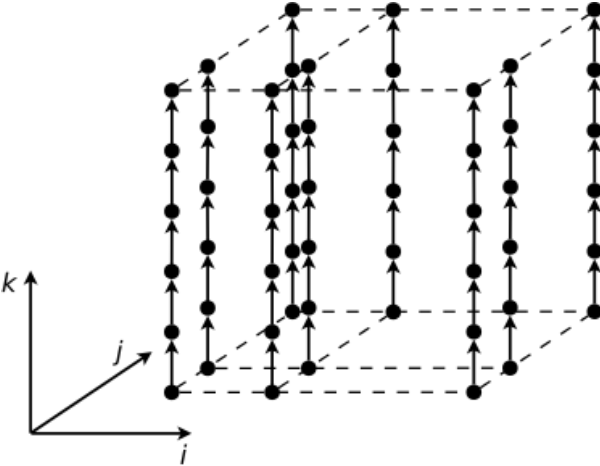
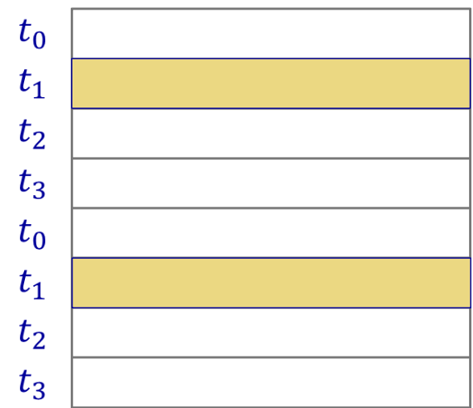
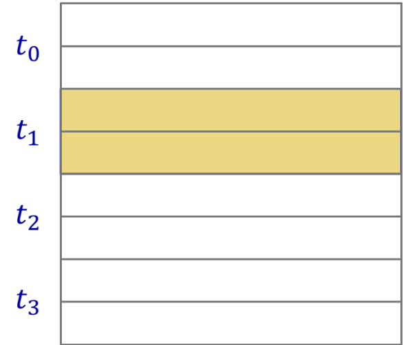
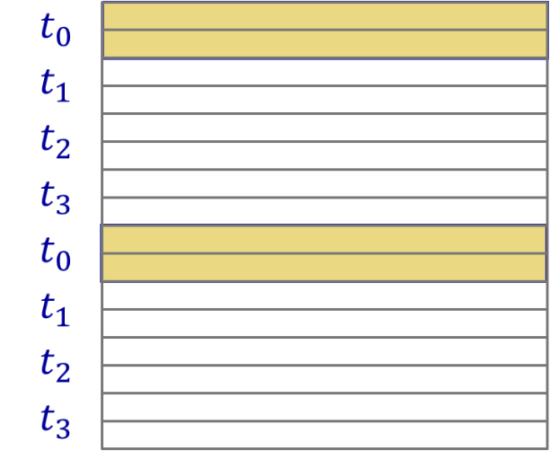

# 第四讲
1. 共享内存平台 
多个线程被创建并并发运行。所有线程共享一组全局变量。线程也有自己的本地私有变量。线程通过共享变量进行隐式通信。线程通过对共享变量的同步进行显式协调。共享内存机器通常规模较小（例如，大型机器约有100个核心）。需要粗粒度并行。  
多线程技术用于共享内存编程：
Pthread - 显式创建线程并同步线程执行。  
OpenMP - 使用编译器指令和子句。  
2. 线程基础 
一个进程和多个线程。  
一个进程中的线程共享相同的地址空间和进程状态，这极大地降低了上下文切换的成本。  
线程并发运行，并通过对共享地址空间中相同位置的读/写进行交互。
不能假设任何执行顺序。  
任何此类顺序必须使用同步机制来建立。存在死锁、饥饿和性能问题。所有通用现代操作系统都支持线程。  
3. 共享内存平台编程 
所有线程共享全局变量。由于数据无需移动，算法设计似乎更容易。
数据分区和数据局部性：  
很重要，但数据到线程的分布通常是隐式的。因为我们必须认真考虑指令级并行（ILP）、内存层次结构和缓存效应。  
显式同步：  
在共享内存机器中，全局数据由多个线程共享。  
必须使用同步来：  
保护对共享数据的访问，以防止竞争条件。施加顺序约束。应用同步时需要防止可能出现的死锁。  
4. 竞争条件 
在共享内存机器中，必须使用同步来保护对共享数据的访问，从而防止竞争条件。当多个线程读写共享数据项时，会发生竞争条件。最终结果变得不可预测。输出取决于谁最后完成“竞争”。  
例如，两个线程同时对一个共享的count变量进行操作，一个递增，一个递减。  
如果假设count的初始值为5，在没有同步的情况下，两个线程完成操作后，count的值可能是4、5或6。 
为什么？
第七页：竞争条件（续） 
每个高级别的递增或递减指令都涉及多个机器级指令（即，读-修改-写）：
```c
count++:
register1 = count
register1 = register1 + 1
count = register1
count--:
register2 = count
register2 = register2 - 1
count = register2
```
count++和count--的机器级指令在执行过程中可能会交错，导致最终结果不确定。   
为防止竞争条件，需要确保一个递增（或递减）操作在另一个操作开始前完成——这称为互斥。   
示例：矩阵乘法 

从图中可以轻易看出，所有的输出元素c(ij)都可以并发计算。然而，这是一种细粒度的并行。对于共享内存机器，我们需要更粗粒度的并行。  
对于粗粒度并行，对输出矩阵C进行分区。没有数据依赖，因此不需要同步。这属于“易并行”（Embarrassingly parallel）问题。注意其规则的数据结构和已知的工作负载。  
静态分区 - 相对容易。  
有多种方式对矩阵C进行分区和分配工作：  
一维循环（1D Cyclic）  
一维块（1D block）  
一维块循环（1D block cyclic）  
...
示例：矩阵乘法（一维循环分区） 
在一维循环分区中，逐行以循环的方式将行分配给线程，直到所有行都被分配完毕。  
  
示例：矩阵乘法（一维块分区） 
在一维块分区中，首先将行分组为块，然后为每个块分配一个线程。
  
示例：矩阵乘法（一维块循环分区） 
首先将行分组为块。  
块的数量远多于线程的数量。  
以循环的方式逐个将块分配给线程。  
  
示例：矩阵乘法（在共享内存机器上）   
没有数据依赖——易并行。可以实现线性加速。重点应放在每个核心上的顺序计算以实现高效率。   
例如，缓存效应、内存层次结构、循环展开和指令级并行（ILP）。  
问题：   
对于 A (n x k)，B (k x m) 和 C (n x m)，当n或m远小于核心数，但k非常大时，如何为此类矩阵乘法设计并行算法？   
回答：  
标准的并行方法是划分输出矩阵 C，让每个线程负责计算 C 的一部分行 。但在您提出的“n 或 m 远小于核心数，而 k 非常大”的特殊情况下，这种方法的效率会很低。

标准方法的局限性
如果直接并行化计算c_ij的外层循环（即 i 从 0 到 n 的循环），由于 n 远小于核心数，你最多只能利用 n 个核心，剩下的核心将处于空闲状态，无法充分发挥多核处理器的性能。

针对性并行算法设计  
核心思想：既然外层循环的迭代次数不足，我们就应该并行化内层 k 维度的计算。  
计算输出矩阵 C 中任何一个元素 c_ij 的公式是：  

由于 k 非常大，这个求和计算本身就是一个计算密集型任务，完全可以被分解成更小的并行任务。
算法步骤如下：
保持外层循环串行：for i = 0 to n 和 for j = 0 to m 的循环保持不变，因为它们的迭代次数很少。
并行化内层求和：对于每一个 c_ij 的计算，我们将 k 次乘法和加法运算分配给所有可用的核心。这本质上是一个**并行归约（Parallel Reduction）**操作。
计算部分和：每个核心计算 k 维度的一个片段（chunk）的“部分和”。例如，如果有 P 个核心，核心0计算 l 从 0 到 k/P - 1 的部分和，核心1计算 l 从 k/P 到 2k/P - 1 的部分和，以此类推。
归约求和：当所有核心都计算完自己的部分和后，将这 P 个部分和加起来，得到最终的 c_ij 值。  
```c++
// A, B, C 是已经初始化好的矩阵
// n, m 远小于核心数, k 非常大

// 外层循环保持串行
for (int i = 0; i < n; i++) {
    for (int j = 0; j < m; j++) {
        
        double sum = 0.0;
        
        // 并行化内层 k 循环的求和过程
        // 使用 reduction(+:sum) 来安全地将所有线程的 sum 部分和相加
        #pragma omp parallel for reduction(+:sum)
        for (int l = 0; l < k; l++) {
            sum += A[i][l] * B[l][j];
        }
        
        C[i][j] = sum;
    }
}
```
5. 使用OpenMP进行共享内存编程   
本课程中使用的许多关于OpenMP的材料来源于：
[1](https://hpc-tutorials.llnl.gov/openmp/)
[2](https://cvw.cac.cornell.edu/OpenMP/)
[3](https://sites.google.com/lbl.gov/cs267-spr2018/)
[4](https://www.openmp.org/wp-content/uploads/omp-hands-on-SC08.pdf)
OpenMP是Open Multi-Processing的缩写。
OpenMP是一种基于指令的应用程序接口（API），用于在共享内存架构上开发并行程序。 
它是用于C/C++和Fortran编程的高级API。 
它包含预处理器（编译器）指令、库调用和环境变量。 
6. 动机 
线程库（如Pthread）使用困难。Pthread线程有许多用于初始化、同步、线程创建、条件变量等的库调用。线程间的同步引入了程序正确性的新维度。   
开发一个能自动将顺序程序转换为并行程序的并行编译器怎么样？  
尽管自动并行化的想法非常吸引人，但在实践中却极其困难，主要原因在于：  
数据依赖性分析：编译器必须 100% 确定代码的不同部分（例如，循环的不同迭代）可以安全地并行执行，而不会相互影响。在复杂的程序中，由于指针、函数调用和复杂的控制流，编译器很难静态地证明数据是独立的。讲义在第 32 页提到的“循环携带依赖”（loop-carried dependencies）就是一个典型的例子。   
对算法的理解：程序员通常最了解算法的内在逻辑和并行潜力。编译器看到的只是一行行代码，它很难像人一样理解更高层次的意图，从而找到最佳的并行策略。  
开销与收益：并非所有可并行的代码都值得并行化。并行化本身会带来额外的开销（如线程创建、同步等）。编译器很难判断并行化带来的性能提升是否能覆盖这些开销。  
中间道路：OpenMP  
正是因为全自动并行的道路充满荆棘，才催生了像 OpenMP 这样的“半自动”或“指令式”并行编程模型 。  
OpenMP 采取了一种务实的折中方案：  
程序员负责“指挥”：程序员使用简单的指令（如 #pragma omp parallel for）来告诉编译器哪里可以并行以及如何并行。这利用了程序员对算法的深刻理解。  
编译器负责“执行”：编译器则根据这些指令，负责处理所有繁琐的底层细节，如线程的创建、销毁、同步和工作分配，从而将程序员从复杂的 Pthread 库调用中解放出来。  
总而言之，开发一个能自动将任意顺序程序高效转换成并行程序的编译器，至今仍然是计算机科学领域的一大难题。因此，OpenMP 这种由程序员指导、编译器执行的协作模式，成为了当前共享内存并行编程的主流和高效选择。   
这时，通过OpenMP指令进行显式并行化应运而生。用相对较少的注解来指定并行性和独立性，从而并行化顺序程序。只有一个小型的API，用更简单的指令隐藏了繁琐的线程调用。     
7. OpenMP基本解决方案栈 
用户层：最终用户、应用程序、编译器（指令、OpenMP库）系统层：OpenMP运行时库、环境变量、操作系统/系统对共享内存和线程的支持
硬件层：多个处理器共享地址空间  
8. 程序员眼中的OpenMP 
OpenMP是一个可移植的、基于线程的、语法“轻量”的共享内存编程规范。它需要编译器支持（C、C++或Fortran）。  
OpenMP将：  
允许程序员将程序分为串行区域和并行区域，而不是显式创建并发执行的线程。隐藏堆栈管理。提供一些同步构造。  
OpenMP不会：自动并行化。保证加速。保证免于数据竞争。  
9. OpenMP执行模型 
分叉-连接（Fork-Join）并行
主线程（Master thread）根据需要派生一个线程团队。并行性是逐步增加的，直到满足性能目标，即顺序程序演变为并行程序。  
执行流程：串行 -> 并行（例如4个线程） -> 串行 -> 并行（例如4个线程） -> 串行。
10. 通用代码结构 
```c++
#include <omp.h>

main () {
    int var1, var2, var3;

    // 串行代码

    // 并行区域开始。派生一个线程团队。
    // 指定变量作用域
    #pragma omp parallel private(var1, var2) shared(var3)
    {
        // 由所有线程执行的并行区域
        // 其他OpenMP指令
        // 运行时库调用
    } // 所有线程加入主线程并解散

    // 继续执行串行代码
}
```
11. OpenMP通用核心 
大多数OpenMP程序只使用以下19个项目。  
OpenMP pragma、函数或子句概念  
#pragma omp parallel并行区域，线程团队，结构化块，跨线程交错执行  
int omp_get_thread_num() 
int omp_get_num_threads() 使用线程数和线程ID创建并行区域并划分工作   
double omp_get_wtime() 加速比和阿姆达尔定律。伪共享和其他性能问题  
setenv OMP_NUM_THREADSN	内部控制变量。使用环境变量设置默认线程数  
#pragma omp barrier	同步和竞争条件。重温交错执行  
#pragma omp critical	
#pragma omp for	工作共享，并行循环，循环携带依赖  
#pragma omp parallel for
reduction(op:list)	跨线程团队的值归约  
schedule(dynamic [,chunk])	循环调度，循环开销和负载均衡  
schedule(static [,chunk])	
private(list), firstprivate(list), shared(list)	数据环境
nowait	禁用工作共享构造上的隐式屏障，屏障的高成本，以及刷新（flush）概念（但不是flush指令）
#pragma omp single单线程工作共享
#pragma omp task任务，包括任务的数据环境
#pragma omp taskwait	

Export to Sheets
12. 并行区域构造 
#pragma omp parallel [clause...] newline
当一个线程遇到parallel指令时，它会创建一个线程团队，并成为该团队的主线程。   
主线程是该团队的成员，其线程号（ID）为0。从这个并行区域开始，所有线程都将执行该区域内的相同代码。在并行区域的末尾有一个隐式的屏障。只有主线程会继续执行此屏障之后的代码。   
创建多少线程？
实现默认 - 通常是节点上的CPU或核心数。   
使用库函数omp_set_num_threads()。 
使用 num_threads 子句设置线程数，例如 #pragma omp parallel num_threads(3)。 
如何获取可用核心数？
使用函数 omp_get_num_procs()。 
如何检查创建了多少线程？
使用函数 omp_get_num_threads()。 
创建的线程从0（主线程）到 nthreads-1 进行编号。 
要获取每个线程的ID，使用函数 omp_get_thread_num()。  
共享变量和私有变量？
在并行区域之外声明的任何变量都是共享的。   
只有一个变量副本，所有线程都引用同一个变量，因此引用时需要小心。   
在并行区域内部声明的任何变量都是私有的。   
每个线程都有自己的变量副本，使用起来是安全的。   
shared 和 private 子句  
private(list) 子句声明其列表中的变量对于每个线程都是私有的。  
shared(list) 子句声明其列表中的变量在团队中的所有线程之间 示例：Hello World  
```c++
//顺序程序
#include <stdio.h>
int main() {
    printf(" hello world\n");
}
```
```c++
//OpenMP程序
#include <omp.h> // OpenMP头文件
#include <stdio.h>
int main() {
    #pragma omp parallel // 并行区域，使用默认线程数
    {
        printf(" hello world\n");
    } // 并行区域结束
}
```
```c++
//使用 -fopenmp 开关编译
//OpenMP程序：gcc -fopenmp。 
//获取线程ID的OpenMP程序 
#include <omp.h>
#include <stdio.h>
int main() {
    #pragma omp parallel // private(tid) 也可以在这里声明
    {
        int tid; // 局部变量
        tid = omp_get_thread_num(); // 每个线程获取自己的ID
        printf("Hello World from thread = %d\n", tid);
    }
}
```
工作共享构造：for指令 
#pragma omp for [clause...] newline
for指令指定其后的循环迭代必须由团队并行执行。 
for指令必须位于并行区域内部。 
```c++
#pragma omp parallel
{
    #pragma omp for
    for (i=0; i<N; i++) {
        c(i);
    } // 线程在此等待，直到所有线程完成并行for循环 [cite: 42]
}
```
默认情况下，循环控制索引i对每个线程是“私有的”。   
OpenMP快捷方式：将parallel和工作共享指令放在同一行。
```c++
// 两种写法等效
#pragma omp parallel
{
    #pragma omp for
    for (i=0; i<MAX; i++) {
        res[i] = huge();
    }
}

#pragma omp parallel for
for (i=0; i<MAX; i++) {
    res[i] = huge();
}
```
工作如何划分和共享？
默认情况下，OpenMP的parallel for使用块分区。
以下代码展示了手动实现块分区与直接使用#pragma omp parallel for的效果是相似的：
```c++
顺序代码：for(i=0; i<N; i++) { a[i] = a[i] + b[i]; }
手动块分区：
#pragma omp parallel
{
    int id, i, Nthrds, istart, iend;
    id = omp_get_thread_num();
    Nthrds = omp_get_num_threads();
    istart = id * N / Nthrds;
    iend = (id+1) * N / Nthrds;
    if (id == Nthrds-1) iend = N;
    for(i = istart; i < iend; i++) { a[i] = a[i] + b[i]; }
}
使用OpenMP指令：
#pragma omp parallel for
for(i=0; i<N; i++) { a[i] = a[i] + b[i]; }
```
13. 工作共享构造：for指令（处理循环） 
处理循环的步骤：  
找到计算密集的循环。使循环迭代独立，这样它们就可以安全地以任何顺序执行，没有循环携带依赖。
放置适当的OpenMP指令并进行测试。  
移除循环携带依赖的例子：
```c++
//有依赖
j = 5;
for (i=0; i<MAX; i++) {
    j += 2;
    A[i] = big(j);
}
//移除依赖后
#pragma omp parallel for
for (i=0; i<MAX; i++) {
    int j = 5 + 2 * (i+1);
    A[i] = big(j);
}
```
示例：矩阵向量乘法 
从一个具有两个循环的顺序程序开始： 
```c++
for (i=0; i<m; i++)
    for (k=0; k<n; k++)
        b[i] += A[i][k] * x[k]; // 假设b已初始化 [cite: 53]
```
问题：应该并行化哪个循环？   
并行化k循环会导致循环携带依赖。 
```c++
//并行化i循环
#pragma omp parallel for shared(A, x, b) private(i, k)
for (i=0; i<m; i++)
    for (k=0; k<n; k++)
        b[i] += A[i][k] * x[k]; // 假设b已初始化 [cite: 57]
```