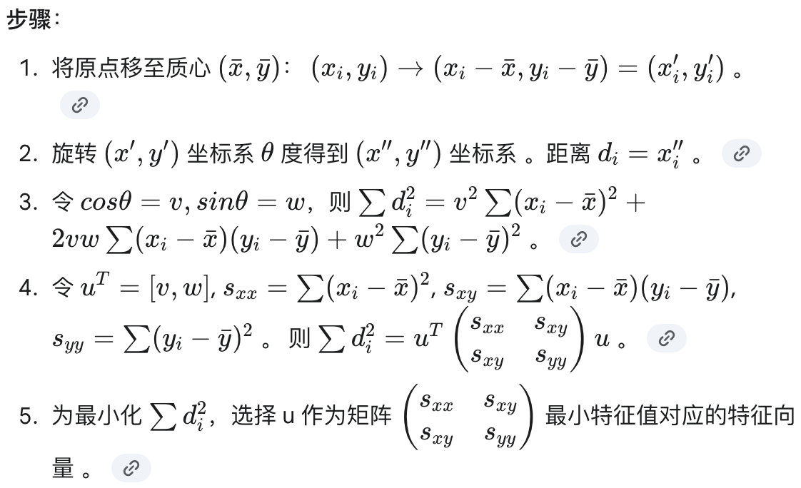

# Summary  
主要讨论了并行计算中的任务分配与负载均衡问题，特别是针对图计算的图划分技术，以及 OpenMP 中用于控制循环迭代分配的 schedule 子句。  
1. 理想加速比与实际加速比 (Ideal and Actual Speedup)  
加速比 (Speedup): S=T(s)/T(p)，其中T(s)是顺序执行时间，T(p)是并行执行时间。理想情况下，使用p个处理单元，我们期望加速比能提高p倍。  
然而在实践中，实际加速比通常小于理想加速比，并且随着处理器数量的增加，差距可能变大。   
2. 并行效率低下的原因 (Causes of Inefficiency)   
单个处理器性能不佳：通常是内存系统瓶颈。  
过多的并行开销：  
同步（Synchronization）。  
通信（Communication）。  
冗余计算（Redundant computation）。  
负载不均衡 (Load imbalance)：  
不同处理器间工作量不同（计算和通信）。  
计算资源速度不同 (例如 CPU + GPU)。  
为了设计高效的并行算法，必须尽量减少所有不必要的开销。  
3. 任务分配 (Task Assignment)  
根据阿姆达尔定律，少量负载不均衡就能显著限制最大加速比。  
需要好的任务分配策略来平衡跨进程/线程的工作负载。  
策略分类：   
静态任务分配 (Static task assignment)。  
动态任务分配 (Dynamic task assignment) (也称动态作业调度或动态负载均衡)。  
静态任务分配 (Static Task Assignment)   
任务到进程/线程的分配是预先确定的。  
优点：简单，运行时开销为零。  
适用场景：任务量可预测的情况。  
分配质量与任务划分质量直接相关。  
对于稠密矩阵计算、规则网格等问题，任务分配相对容易。  
对于稀疏矩阵、非结构化网格和图等问题，则更为复杂，需要考虑如何平衡工作负载、最小化通信开销和冗余计算。  
4. 图划分 (Graph Partitioning)  
图划分是将一个图分解成若干个较小图的过程。  
应用广泛：科学计算、VLSI 电路设计、计算机图形学、Web 图分析等。  
对于使用并行机进行大规模图计算/分析，图划分是重要的预处理步骤。  
图划分的定义   
给定图 G=(N,E,W(N),W(E))，其中 N 是顶点，E 是边，W(N)是顶点权重，W(E)是边权重。  
目标：将 N 划分为 N(1) ∪ N(2) ∪ ⋯ ∪ N(p)，使得：每个子集 N(i)中的节点权重之和大致相等（负载均衡）。  
连接不同子集 N(i)和 N(j)之间的所有边的权重之和最小化（最小化通信，即最小化边切割集）。  
图对分 (Graph Bisection)   
实践中，通常有 N=2的k次个部分，可以通过递归地对分图 k 次来实现。  
图对分通常是一个 NP (非确定性多项式) 问题，因此需要好的启发式算法。  
使用几何信息的划分 (Partitioning with Geometric Information)   
如果图源于二维或三维空间结构（如 PDE 求解），几何坐标可以附加到顶点上，从而知晓图的几何布局。  
这些额外信息有助于解决划分问题。  
坐标对分 (Coordinate Bisection)   
最简单的基于坐标的划分方法。  
可以简单地画一条垂直于某个坐标轴（例如 x 轴）的超平面，将顶点均分为两部分。  
对于递归对分，交替对 x、y 和 z 坐标进行对分，可以获得更好的纵横比，并有望降低边切割规模。  
在二维空间中，选择一条垂直于 x 轴且通过质心 (x, y​) 的线 L，然后将线左边的网格点归入 N(1)，右边的归入 N(2)。  
缺点：依赖于坐标系。同一结构在不同坐标系下可能划分得相当不同，可能无法最小化边切割。  
惯性对分 (Inertial Bisection)   
基本思想：选择一个超平面，使得顶点到该超平面的距离平方和最小化。  
通过坐标旋转使网格点到直线 L 的距离平方和最小化。目标是求解最小化问题： min∑i=1 N di的平方，其中 d(i)是网格点 (x(i),y(i)) 到直线 L 的距离。    

无几何信息的划分 (Partitioning without Geometric Information)   
许多实际问题中，图的顶点没有几何信息（例如 WWW 模型，顶点是网页）。  
需要不同的算法来处理此类问题。  
时间与质量的权衡 (Time vs. Quality)   
算法执行时间与解的质量之间通常存在权衡。  
选择取决于具体应用：  
VLSI 设计：倾向于高质量解，因为微小的改进也能节省成本。  
稀疏矩阵计算：更关注总时间，图划分的执行时间必须小于并行矩阵计算节省的时间。  
因此，没有适用于所有情况的单一最佳解决方案。  
5. OpenMP parallel for 指令的 schedule 子句
for 循环迭代的默认划分方式是块划分（block partitioning）。迭代被划分为若干组，每组包含大小相等的一系列连续迭代。  
很多情况下，希望以不同的块大小划分迭代，或者循环划分（cyclic partitioning）。  
解决方案：使用 schedule 子句。  
schedule 子句的类型   
schedule(static[, chunk])  
将大小为 "chunk" 的迭代块分配给每个线程。  
静态调度在编译时完成。  
块大小是预先确定的，程序员可预测，运行时工作量最少。  
例如：  
schedule(static)：块划分。  
schedule(static, 1)：循环划分。  
schedule(dynamic[, chunk])  
每个线程从队列中获取 "chunk" 大小的迭代块，直到所有迭代都被处理完毕。  
动态调度在运行时使用复杂的调度逻辑。  
适用于每次迭代工作量不可预测、高度可变的情况，运行时工作量最大。  
6. 问题1 (Page 10): 对于图对分，有多少种可能的划分方式？  
答:可能的划分数量为 (NN/2)=N!/((N/2)!)2，这个值约等于 2的N次 * sqrt（2/（π*N））。	​
这表示对于一个有 N 个顶点的图，将其对分成两个各有 N/2 个顶点的子图，可能的组合数量是巨大的，随着 N 的增长呈指数级增长。这正是图对分问题通常被认为是 NP 难问题的原因之一。  

7. 问题2 (Page 24 Lab Exercise - 隐含的问题/挑战): 在实现 C=AA（T）的并行计算时，如何考虑负载均衡？
解：  
由于只需要计算对称矩阵 C 的上三角部分 (i≤j) ，如果直接按行 (i) 来并行化最外层循环，那么处理第一行的线程工作量最大（计算 n 个元素），处理最后一行的线程工作量最小（计算 1 个元素），这会导致严重的负载不均衡。
为了解决这个问题：  
动态调度：使用 schedule(dynamic[, chunk]) 子句 。让线程动态地从任务队列中获取计算任务（例如，计算某个 c（ij）。当一个线程完成其当前块任务后，它可以获取新的任务块。这有助于平衡不同迭代计算量不均的情况。选择合适的 chunk 大小很重要，太小可能导致调度开销过大，太大则可能无法有效平衡负载。  
更细致的静态划分：虽然标准的 schedule(static) 可能不理想，但可以设计更复杂的静态划分方案，或者如果内层循环足够大，可以考虑并行化内层循环，或者将上三角的计算任务更均匀地映射到线程上，但这会增加实现的复杂度。  
讲义中提到要考虑负载均衡 ，schedule 子句是 OpenMP 中直接处理循环负载均衡的方式。  
8. 问题3 (Page 25 Homework 4 - 隐含的问题/挑战): 在为带部分主元的高斯消元法添加 OpenMP 指令时，需要注意什么？  
解:  
高斯消元法通常包含以下步骤，并行化时需要注意：
寻找主元 (Pivoting)：在当前列中寻找绝对值最大的元素。这一步可能涉及到所有待处理行的数据比较。可以并行化查找过程，但最终确定主元并进行行交换可能需要同步。  
行交换 (Row Swap)：如果主元不在当前行，需要进行行交换。这是一个数据移动操作，需要确保所有线程在继续下一步之前都已看到交换后的数据。  
消元 (Elimination)：对主元所在行以下的每一行进行操作，使其主元列的元素变为0。这一步通常是计算密集型的，并且不同行的消元操作是独立的，非常适合并行化。可以使用 #pragma omp parallel for 来并行处理这些行。  
数据依赖：需要注意循环携带依赖，确保用于消元的“主行”数据在该迭代的所有线程中都是一致且最新的。通常，主行数据在消元步骤开始前是固定的，因此 shared 声明是合适的。
同步：在每一轮消元（处理完一列）后，通常需要一个屏障 (#pragma omp barrier 或隐式屏障），以确保所有线程都完成了当前列的消元，才能进入下一列的主元选择。  
lecture 中提到了同步构造如 barrier ，以及数据依赖的概念，这些在高斯消元的并行化中都非常关键。  