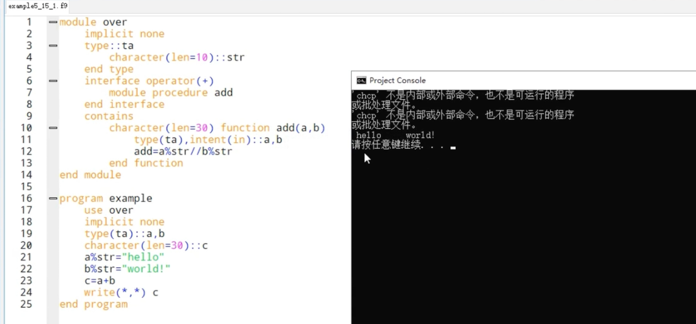

# fortran入门 #  
**1.程序的基本结构**  

1. fortran程序通常以program开头,main为程序名称，可以为任意，并不需要和文件名有任何的关系。 
2. stop表示程序的终止，可以省略，只是让我们明确知道程序到此结束。
3. end 用来封装程序代码的，说明程序代码已经编写完毕。
***end不能省略***
```f90
program main
    ……
    stop
end
```
4. Fortran 90标准中，end可以使用下列3种方法：  
```
end
end program
end program main
```
**2.输出命令**
1. write命令
格式：
```
write(*,*)a
```
*write*  
第一个  \*表示**输出的位置使用默认值，即屏幕  
第二个\*则代表不特别设置输出格式。  
*写法：* 
```f90
write(6,*)"string"  
!较为严谨写法 
write（unit=6，fmt=*）“string”
！最严谨的写法
```
*注意*  
（1）每一次执行write命令后，会自动换到下一行来准备做下一次的输出  
（2）如果要在字符串中输出双引号，则要连用两个双引号。  
**2.print命令**  
*格式*  
``` f90
print*,a
```
print命令与write大致相同。  
但是print后面不使用括号，且只有一个\*号，这个星号的意义是不限定输出格式。  
print相比于write的不同之处在于**少了赋值输出**位置的能力，print只针对于屏幕输出使用。 
# 3.输入命令#  
1. read  
*格式* 
```f90 
read(*,*)a
```
第一个\*代表输入的来源使用默认设备（也就是键盘）  
第二个\*代表不指定输入格式。  
*写法 :*  
```f90
read(5,*)a
!较严谨  
read(unit=5,fmt=*)a
!最严谨
```
# 4.基本数据类型 #  
1. integer（int）  
格式：
```f90
integer::a
```
(1) 长整型  
```f90
integer(kind=4)a
!fortran 90添加
integer*4 b
!fortran 77
integer(4)c
!fortran 77
```
(2)短整型  
```f90
integer(kind=2)a
!fortran 90
integer*2 b
!fortran 77
integer(2) c
!fortran 77
```
2. real(浮点型)  
格式：  
```f90
real a
```
不加上任何形容词时，通常会声明占用4 bite的单精度浮点数声明：
```f90
real(kind=4)a
!fortran 90
real*4 b
!fortran 77
real(4) c
!fortran 77
```
双精度：  
```f90
real(kind=8)a
!fortran 90
real*8 b
!fortran 77
real(8) c
!fortran 77
```
3. 复数(complex)  
格式：  
complex a  
复数是由实部和虚部两部分组成。  
在fortran中保存复数的方法是用两个浮点数来保存。  
故：复数可以分为单精度和双精度：
```f90
!单
complex(kind=4)a
complex*4 b
complex(4)c
!双
complex(kind=8)a
complex*8 b
complex(8) c
```
*设置复数数值*  
```f90
a=(x,y)
```
4. 字符与字符串(character)  
*格式：*  
```f90
character a
```
*声明*
```f90
character(len=10)a
！长为十的字符串
character(10) b
character*10 c
character*(10) d
```
字符串类型除了直接设置之外，还可以改变字符串的某部分，字符串可以一次只改变其中的几个字符  
字符串也可以连接，连接方法是通过字符串“//”完成  
```f90
program example
    character(20)::string
    string="Good morning."
    write(*,*) string
    string(6:)="evening."
    write(*,*) string
    string(13:13)="!"
    write(*,*) string
    string(1:2)="GO"
    write(*,*) string
    stop
end
```
```f90
gfortran hello.f90 -o hello
./hello

!cout
Goodmorning.   Goodevening.   Goodevening!   GOodevening! 
```
```f90
program example
    character(20)::string
    character(30)::add
    string="Good morning."
    add=string//"Fortran!"
    write(*,*) add
    stop
end
```
```
 Good morning.       Fortran!
```
*fortran 有关字符串运行的函数*  

|char(num) |返ASCII字符表中数值num所代表的字符|
|-----------|----------------|
|ichar(char) | 返回字符char的ASCII编号 |
|len(string)|返回字符串的长度（数组大小）|
|len_trim(string)|返回字符串去除尾端空格后的实际长度（即实际数组有多少）|
|index(string,key)|返回key在字符串string第一次出现的位置|
|trim(string)|返回把string字符串尾端空余空格清除后的字符串|
5. 逻辑型（logical） 
格式：
```f90
logical a
```
设置逻辑变量的方法如下：
```f90
a=.true.
b=.false.
!两个“.”不可少
```
## fortran ##
格式化输入输出：  
```f90
program example
    integer::a=20
    write(*,100)a
    !使用行代码为100的格式来输出变量
    100 format(I4)
    !format（I4）输出宽度为四的整型
    write(*,*) a
    stop
end
```
```f90
program example
    integer::a=20,b=10
    write(*,"(I4)") a
    write(*,"(I4,I4)") a,b
    write(*,"(2I4)") a,b
    write(*,*) a
    stop
end
```

6. implicit命令  
Fortran标准中有一项不太好的功能：  
变量并不一定要经过程序的声明才能使用；  
第一个字母为“I、J、K、L、M、N、”视作为integer 
```f90
implicit integer(A,B,C)
!第一个字母abc视作为integer
```
其他视作为real
```f90
program implicit none
!禁止这种“默认类型”
```
7.parameter  (#define pi 3.1415)  
```f90
real,parameter::pi=3.1415
```
```f90
real pi
parameter(pi=3.1415)
```
8. equivalence (int &b=a)  
```f90
equivalence(a,b)
!a,b使用同一块空间
```

**执行代码之后就不能声明变量**  
```f90
program example
    integer::a=20
    write(*,*) a
    integer::b=10
    !会报错
    write(*,*) b
    stop
end
```
10. 自定义数据类型  
```f90
program example
    implicit none
    type::person
        character(len=10)::name
        integer::age
        real::high
        real::weight
        character(len=50)::adress
    end type person
    type(person)::a,b
    a=person("peter",20,170,60,"china")
    b%name="fortran"
    write(*,*) a
    write(*,*)b%name
    !b%name==(cpp a.name)
    stop
end program
```
# 条件判断语句#
1. if
```f90
program example
    implicit none
    integer::a=3
    if(a>2)then
        write(*,*)"a>2"
    end if
    !end if封装
    ！then end if均不能省略
end
```
2. if else
```f90
program example
    implicit none
    integer::a=1
    if(a>2) then
        write(*,*)"a>2"
    else
        write(*,*)"a<=2"
    end if
    stop
end
```
3. if else if
```f90
program example
    implicit none
    integer::a=1
    if(a>2) then
        write(*,*)"a>2"
    else if(a==2) then
        write(*,*)"a=2"
    else if(a<2) then
        write(*,*)"a<2"
    else
        write(*,*)"....."
    end if
    stop
end
```
# 逻辑运算符#
|sign|meaning|sign|meaning|sign|meaning|
|--|--|--|--|--|--|  
|==|等于|>|大于|<|小于|
|/=|不等于|>=|大于等于|<=|小于等于|
 
了解即可 
# selet case语句(switch) #
```f90
select case(变量)
case(数值1)
...
case(数值2)
...
case(数值3)
...
case deffault
...
end select
```
1. case default 是可选的，并不一定要出现代码中  
2. case(1:5代表这两个数字范围内的所有数值，case括号内还可以用逗号来放入多个数值)  

*局限*  
1.只能使用integer、character、logical，不能使用real与complex
2. 每一个case中所使用的数值必须是固定常量，不能是变量。
```f90
program example
    implicit none
    integer::a=4
    select case(a)
    case(1)
        write(*,*)"this 1"
    case(2)
        write(*,*)"this 2"
    case(3)
        write(*,*)"this 3"
    case(4,5)
        write(*,*)"this 4 or 5"
    case default
        write(*,*)"Unknow"
    end select
    stop
end
```
# goto #
goto命令提供程序员一个任意跳转到任意一行代码的能力，被跳过的代码不会被执行。  

# pause #
程序执行到pause时，会暂停执行，直到用户按下Enter才会继续执行（可以用在大量输出数据时，在合适的位置暂停，便于阅读）  
# continue #  
**与c++等其它的不同，他的功能与stop相反**
继续向下执行程序  
# stop #  
终止程序  

# 循环 #  
## do循环 ##  
格式：
```f90
do counter=1,lines,1
    ……
end do
！for（int counter=1；counter<=lines；counter++）  
```
```f90
program example
    implicit none
    integer::a
    do a=1,10,1
        write(*,*)a
    end do
end
```
## do while ##  
```f90
do while()
    ...
end do
```
# 循环的流程控制 #
## cycle命令 ##
cycle命令可以跳出本次循环（c++中continue）  
## exit命令 ##  
。。。（类似c++中break）  
```f90
program exmaple
    implicit none
    integer::a,b
    do a=1,4,1
        do b=1,5,1
            if(b==3) then
                write(*,*)"continue!"
                cycle
                !exit
            end if
            write(*,"(2(A4,I3))")"a=",a,"b=",b
        end do
    end do
end
```
# 署名的循环 #  
```f90
program example
    implicit none
    integer::a,b
    loop1: do a=1,10,1
        loop2:do b=1,5,1
            write(*,*)"this is a test!"
        end do loop2
    end do loop1
end
!除了do，像其他的if等也可以像这样的形式署名
```
# 一维数组 #
```f90
integer a(10)
!()中只能用常量来指定，常量或parameter修饰后的常量
!数组除了用5种基本数据类型，还可以使用自定义类型
```
# 二维数组 #
```f90
integer arr(2,2)
!同 c++ 二维数组
```
# 数组的索引 #
*Fortran中数组索引值从1开始*  
```f90
integer a(0:5)
!把索引值设置由0-5
```
# 数组的初始化 #
```f90
integer a(5)
data a/1,2,3,4,5/

integer a(5)
!声明
data a/5*3/
！5个3
integer::a(5)=(/1,2,3,4,5/)
！注意括号和“/”之间没有空格

!隐含式
integer a(5)
integer i
data(a(i),i=1,4)/1,2,3,4/
```
之上的隐含式：
“隐含”的循环省略了do的描述，除了应用于声明的初值设置，还可以应用其他代码  
如：
```f90
write(*,*)(a(i),i=2,5)
!输出a（2）至a（5）
write(*,*)(a(i),i=2,5,2)
!输出a（2）a（4）
！设置计数器的累加数值
```
”隐含式“循环也可以应用于多维数组：  
```f90
integer a(2,2)
integer i,j
data((a(i,j),i=1,2),j=1,2)/1,2,3,4/
!a(1,1)=1,a(2,1)=2,a(1,2)=3,a(2,2)=4
```
省略data直接把初值写在声明后面时，不能像使用data时一样使用隐含式循环对数组的部分元素设置初值，而是必须每个元素都要给定初值：
```f90
integer::i
integer::a(5)=(/1,(2,i=2,4),5/)
!隐含式循环把a（2-4）的值都设置为2
integer::a(5)=(/1,(i,i=2,4),5/)
!a(2)=2 a(3)=3 a(4)=4

!这样子必须每个都赋初值，data可以不给每个赋值
```
# fortran 的存储规则 #  
竖着存  
# 数组的操作 #  
1. a=5  
    其中a是一个任意维数以及大小的数组，这个命令把数组a的每一个元素都设置为5  
2. a=b  
    a与b必须是同样维数和大小的数组。相同位置设置为一样  
3. a=b+c 
    a，b，c是三个同样的数组，这命令会把数组b和c中间相同位置的元素相加，并放在相同的地方  
4. a=b-c  
    同理  
5. a=b*c
    相乘，放于相同地方  
6. a=b/c  
    相除  
7. a=sin（b）  
    a的元素为sin（b）  
8. a=b>c  
    把比较结果放在a中  

# where 命令 #  
where 命令可以经过逻辑判断来使用数组的部分元素  
例如：  
```f90
where(a<3)
    b=a
end where
！把a数组中找出小于3的元素，并赋到b的相同位置
！a，b必须是相同的数组
```
*类似if，当程序只有一行代码时，where的end where可以省略*  
*where可以多重判断，只要在elsewhere 后面接上逻辑判断即可*  
```f90
program example
    implicit none
    integer::a(4)=(/1,2,3,4/)
    integer::b(4)
    where(a<=2)
        b=1
    elsewhere(a>2)
        b=2
    elsewhere
        b=3
    end where
    write(*,*) b
end program
```
# forall 命令 #
*forall可以看成使用“隐含式”循环来使用数组的方法*  
```f90
forall(triplet1[,triplet2[,triplet3……]],mask)
    ……
end forall
```
mask是用于做条件判断，与where命令中使用的条件判断类似  
它可以用于限定forall程序模块中，只作用与数组中符合条件的元素  
```f90
program example
    implicit none
    integer::i,j
    integer::a(4),b(3,4)

    first: forall(i=1:4)
        a(i)=3
    end forall first
    write(*,*)a

    second: forall(i=1:3,j=1:4)
        b(i,j)=i+j
    end forall second
    write(*,*)b

    third: forall(i=1:3,j=1:4,b(i,j)<5)
        b(i,j)=0
    end forall third
    write(*,*) b
end
```
# 大小可变的数组 #
```f90
integer::size
integer,allocatable::a(:)
!声明一个可变的数组
allocate(a(size))
!配置内存空间
deallocate(a)
!释放申请的内存空间（注意内存泄漏）

!size是一个变量，可以由用户进行设置
```

# 子程序 #
写程序时，可以把某一段经常使用的，具有特定功能的程序代码独立出来，封装成子程序，以后只需要经过调用的call 命令就可以执行这一段程序代码  
```f90
program example
    implicit none
    integer::a=1,b=2
    call message()
    !调用message
    call add(a,b)
end
!子程序message
subroutine message()
    implicit none
    write(*,*)"hello"
    return
end
subroutine add(first,second)
    implicit none
    integer:: first,second
    write(*,*) first,second
    return
end
```

# 自定义函数 #
自定义函数的运行和上面所提到的子程序大致相同的，他也需要经过调用才能执行，也可以独立声明变量，传递参数也和子程序一样，和子程序只有两种不同：
1. 调用自定义函数前要声明  
2. 自定义函数执行后会返回一个数值  
```f90
program example
    implicit none
    integer::a=2,b=3
    integer,external::add
    !声明add是一个函数
    write(*,*)add(a,b)
end
function add(first,second)
    implicit none
    integer::first,second
    integer::add
    !add跟函数名称一样，这里不是用来声明变量
    ！这里是声明这个函数会返回的数值类型
    add=first+second
    return
    !只能和函数名字一样
end
```
另外一种定义方法：
```f90
program example
    implicit none
    real::a=1
    real::b
    real::add
    add(a,b)=a+b
    write(*,*)add(a,3.0)
end
```
全局变量：
```f90
program example
    implicit none
    integer:: a,b,c,d,e,f
    common a,b,c,d,e,f
    a=1
    b=2
    f=7
    call show()
    write(*,*)a,b,f
end
subroutine show()
    implicit none
    integer :: num1,num2,num3,num4,num5,num6
    common num1,num2,num3,num4,num5,num6
    num1=5
    num6=999
    return
    !上下对应a对应num1，一一对应
    !如果要改f的话，需要把所有的全局变量声明出来。
end
```
```f90
！解决上面的问题
!把f分到group2，就不用写一大堆了
program example
    implicit none
    integer:: a,b,c,d,e,f
    common /group1/ a,b,c
    common /group2/ d,e,f
    data a.b.c /1,2,3/
    data d,e,f /4,5,6/
    write(*,*) a,e
    call show()
    write(*,*) a,e
end
subroutine show()
    implicit none
    integer ::num1,num2,num3,num4,num5,num6
    common /group1/num1,num2,num3
    common /group2/ num4,num5,num6
    num1=34
    num2=25
    return
end
```
# fortran 变量声明期 #
*save命令可以把局部变量的生命周期设置成与整个程序的执行时间一样长
```f90
program example
    implicit none
    integer,external::show
    integer::a,b
    a=show()
    b=show()
    call sub()
    call sub()
end program

subroutine sub()
    implicit none
    integer ::count=1
    save count
    write(*,*)count
    count=count+1
    return
end subroutine

integer function show()
    implicit none
    integer :: i=1
    save i
    write(*,*)i
    i=i+1
    return
end function
```
# 传递参数 #
program example
    implitic none
    real,external ::func
    !声明func是一个自定义函数
    real,intrinsic ::sin
    !声明sin是库函数
    call test(func)
    call test(sin)
end program

subroutine test(f)
    implicit none
    real,external ::f
    ！声明一个函数来接收传输进来的函数
    write(*,*)f(1.0)
    return
end subroutine

real function func(num)
    implicit none
    real ::num
    func=num*2
    return
end function

# 参数的只读操作 #

*与其他程序语言不同，fortran的函数和子程序内定义的变量是可以影响外部变量的*

*所以用intent声明参数为只读的*
```f90
integer,intent(in)::a
!指定a为只读，不能改变
integer,intent(out)::b
!指定b在子程序中应该可以重新设置数值
integer,intent(inout)::c
!指定c可读可写
```
*除了第一行是指明参数可读之外，2、3行的声明效果相同*  
```f90
program example
    implicit none
    integer ,external ::func
    integer ::f
    integer ::a=1
    write(*,*)a
    call sub(a)
    write(*,*)a
    f=func(a)
    write(*,*)a
end program

subroutine sub(num)
    integer::num
    !integer,intent(in)::num 此时781这句就错误
    num=3
    return
end subroutine

integer function func(num)
    integer ::num
    num=7
    return
end function
```
输出1 3 7；其实这个参数和实参共用一个地址  

# 函数的使用接口 #
1. interface 是一个程序模块，用来说明所调用函数的参数类型以及返回类型等等的“使用接口”
2. 一般情况下使用函数的时候并不需要特别说明他们的“使用接口”
3. 必要的情况：  
(1). 函数返回值为数组  
(2). 指定参数位置来传参数  
(3). 所调用的函数参数数目不固定时  
(4). 输入指标参数  
(5). 函数返回值为指针时
```f90
program example
    implicit none
    interface
        function random10(lbound,ubound)
            implicit none
            real :: lbound,ubound
            real :: random10(10)
        end function
    end interface
    real ::a(10)
    call random_seed()
    a=random10(1.0,10.0)
    write(*,"(10F6.2)") a
end program
!random10会返回10个范围内在lbound到ubound之间的随机数
function random10(lbound,ubound)
    implicit none
    real:: lbound,ubound
    real:: len
    real:: random10(10)
    real t
    integer i
    len=ubound-lbound
    do i=1,10
        call random_number(t)
        random10(i)=lbound+len*t
    end do
    return
end function
```
# optional 不定个数的参数传递 #
fortran 90 中可以使用 optional 命令来表示某些参数是可以省略的，这个功能与其他程序语言中的函数重载有一定相似之处  

integer,optional ::b  
```f90
program example
   implicit none
   interface
        subroutine sub(a,b)
            implicit none
            integer ::a
            integer ,optional::b
        end subroutine
    end interface
    call sub(1)
    call sub(2,3)
    stop
end program
subroutine sub(a,b)
    implicit none
    integer::a
    integer,optional::b
    ！b必须写在a之后，类似默认参数
    if(present(b))then
        write(*,"('a=','13','b=',I3)")a,b
    else
        write(*,"('a=',I3,‘b=none’)")a
    end if
    return
end subroutine sub
```
# 改变参数传递位置的方法 #
在fortran 90中，可以不需要按照参数顺序传递参数，类似python中调用函数时func（b=3，a=4）的这种写法。  
```f90
subroutine sub(a,b,c)
    ...
end subroutine sub
!调用时
call sub(b=2,c=3,a=1)
!使用这个方法时，要声明接口interface
```

# 函数递归 #
需要加一些声明  
```f90
program example
    implicit none
    integer ::n
    integer,external::fact
    write(*,*)"N="
    read(*,*)n
    write(*,"(I2,'!=',I8)")n,fact(n)
    stop
end program
recursive integer function fact(n) result(ans)
!只能ans返回
    implicit none
    integer,intent(in)::n
    if(n<0)then
        ans=-1
        return
    else if(n<=1)then
        ans=1
        return
    end if
    ans=n*fact(n-1)
    return
end function
```
# contains 内部函数 #
可以理解为函数的嵌套，只能被他的函数、子程序、主程序调用

# module #
module可以用来封装程序模块，通常用来把程序中有相同功能的函数和变量封装在一起  
```f90
module name
    ...
end
```
需要使用全局变量时，可以把全局变量都声明在module中，需要使用这些变量的函数在需要use这些module即可  
```f90
module global
    implicit none
    integer a,b
end module

program example
    use global
    implicit none
    a=1
    b=2
    write(*,*)a,b
    call sub()
    write(*,*)a,b
end program

subroutine sub()
    use global
    a=5
    b=9
    return
end subroutine
```
  
并不需要对函数进行声明或者加入一个函数接口，用一个use global 就可以直接用了  

# 函数重载 #
需要在module中使用interface，可以用来定义一个虚拟函数名称  


# entry 命令 #
在函数中创建一个新的入口，调用这个入口时，程序会跳过进入点之前的程序代码，从入口开始执行该入口所在的函数.进入口前面是不执行的。


# 自定义操作符 #
自定义类型一定要用intent限定

! interface operator(+)  
    module procedure add 相当于给add一个别名  
可以定义没有的符号  
interface operator(.dot.)